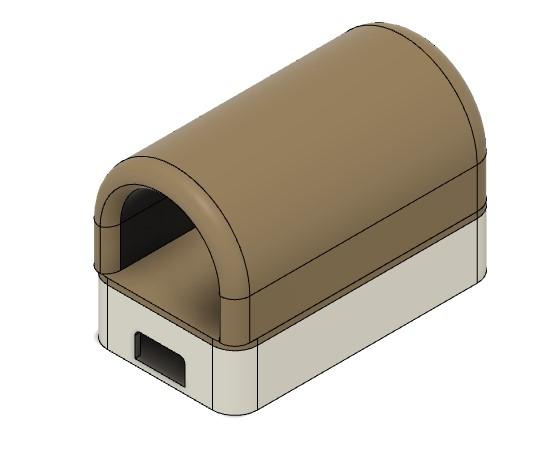

# OxiFine
Redefining Oximetrics

OxiFine is an open-source Pulse Oximeter device made using minimal components and simplest design aspects. It is a modular device which is different from the conventional pulse oximeters. The makers can build the device and can monitor the pulse rate in bpm and SpO2 level in % using the companion mobile application. This will take away the display unit from the device and we can power it using a normal micro-b usb power adapter so that batteries can also be avoided. This will ultimately reduce the size and cost of the product.

3D CAD Model

[See the model here ](https://a360.co/3g6MCbJ)