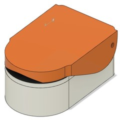

# OxiFine
Redefining Oximetrics

Made by:-
- Vishnu P Kumar
- B.Tech Student
- Electronics and Communication Engineering
- Mar Baselios College of Engineering and Technology

Guided by:-
- Arun JS
- Assistant Professor
- Department of Electronics and Communication Engineering
- Mar Baselios College of Engineering and Technology

  

OxiFine is an open-source Pulse Oximeter device made using minimal components and simplest design aspects. It is a modular device which is different from the conventional pulse oximeters. The makers can build the device and can monitor the pulse rate in bpm and SpO2 level in % using the companion mobile application. This will take away the display unit from the device and we can power it using a normal micro-b usb power adapter so that batteries can also be avoided. This will ultimately reduce the size and cost of the product.

## 3D CAD Model

 

[See the model here ](https://a360.co/3g6MCbJ)

## Blynk Application

## Components Used

1. NodeMCU [Buy it here](https://www.amazon.com/HiLetgo-Internet-Development-Wireless-Micropython/dp/B081CSJV2V/ref=sr_1_3)
2. MAX30100 [Buy it here](https://www.amazon.com/DollaTek-MAX30100-Heart-Rate-Oximeter-Pulsesensor/dp/B07DK6PF2Y/ref=sr_1_2)

## Circuit Diagram

SPI Communication is being used to communicate with the MAX30100 Pulse Oximeter Module.

## Internal View

## Test Results
There are two types of Pulse Oximeters currently available in the market. They are reflectance type and transmission type. OxiFine is a reflectance type pulse oximeter. The accuracy test was performed at Sree Chitra Tirunal Institute for Medical Sciences and Technology (SCTIMST), Trivandrum, India.
The Avon Pulse Oximeter which was validated for accuracy using Prosim 8 Pulse Oximeter tester, was used to compare with OxiFine and the test results were as follows.

